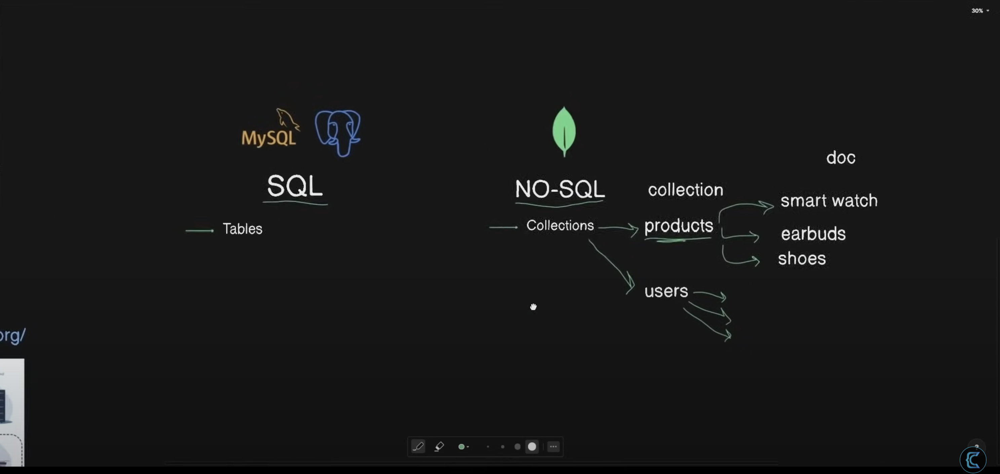

# MERN Project Notes

## Project Setup

1.  **Module Type**: This project uses ES Modules. The `"type": "module"` property is set in `package.json`, which allows for the use of `import`/`export` syntax.

2.  **Dependencies**: The core dependencies were installed using npm:
    ```bash
    npm install express dotenv mongoose
    ```
    For development, `nodemon` is used to automatically restart the server on file changes. It was installed as a dev dependency:
    ```bash
    npm install -D nodemon
    ```

3.  **Environment Variables**: Configuration for the application is managed through a `.env` file in the project root. The `dotenv.config()` function reads this file and loads the variables into Node.js's `process.env` object.

    Create a `.env` file and add the necessary variables:
    ```
    PORT=4000
    MONGO_URI=<your_mongodb_uri>
    ```
    note that we added /products in the URI as the database is targeting a products page not the application home page. Note that we created a cluster and a project on mongodb where we got the connection string.
    * Note tha the network access is restricted to the IP of the device you are working on. 
    * I allowed access from everywhere for this project 


    **Note**: The `.env` file should be listed in `.gitignore` and should not be committed to version control.

4.  **Database Connection**: The connection logic is in `backend/config/db.js`. The application connects to MongoDB before starting the Express server. If the connection fails, the process will exit.

5.  **Data Models**: The application uses Mongoose to define schemas for the data. The models are located in the `backend/models` directory.
    -   **Product Model**: Located at `backend/models/product.model.js`, this schema defines the structure for products, including `name`, `price`, and `image` fields, along with timestamps.

## Running the Application

To start the server in **development mode** (which will automatically restart on file changes), use the `dev` script:
```bash
npm run dev
```

This command executes `node backend/server.js` to start the application.
This command executes `nodemon backend/server.js` to start the application using nodemon to reflect changes automatically.

## API Endpoints

To handle incoming requests, the Express server is configured to parse JSON-formatted request bodies using the `express.json()` middleware. This is essential for the `POST /api/products` endpoint to be able to read the product data sent from the client.

### Create a Product (`POST /api/products`)
This endpoint is responsible for creating a new product and saving it to the database.

*   **Request Body**: The endpoint expects a JSON object in the request body containing the product's `name`, `price`, and `image`.
*   **Asynchronous Function**: The route handler is declared as an `async` function. This is crucial because interacting with a database is an I/O operation that takes time. Using `async/await` allows the server to handle other requests while waiting for the database to save the document, preventing the application from freezing.
*   **Process Flow**:
    1.  The server receives a `POST` request containing the new product's data in `req.body`.
    2.  It uses the `Product` Mongoose model to create a new product document.
    3.  The `await Product.create(req.body)` line attempts to save this new document to the MongoDB database.
    4.  **Success**: If the product is saved successfully, the server responds with a `201 Created` status code and the newly created product object as JSON.
    5.  **Failure**: The endpoint has two main error-handling paths:
        -   **`400 Bad Request`**: If the `name`, `price`, or `image` fields are missing from the request body, the server will respond with this status code.
        -   **`500 Internal Server Error`**: If an error occurs on the server while trying to save the product to the database, the server will respond with this status code.

*   **Testing with Postman**: You can test this endpoint using a tool like Postman. Send a `POST` request to `http://localhost:4000/api/products` with a `Content-Type` header of `application/json` and a raw JSON body like: `{"name": "My Product", "price": 10.99, "image": "image_url.jpg"}`.


# Screenshots 
